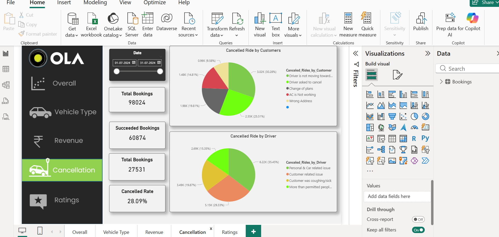
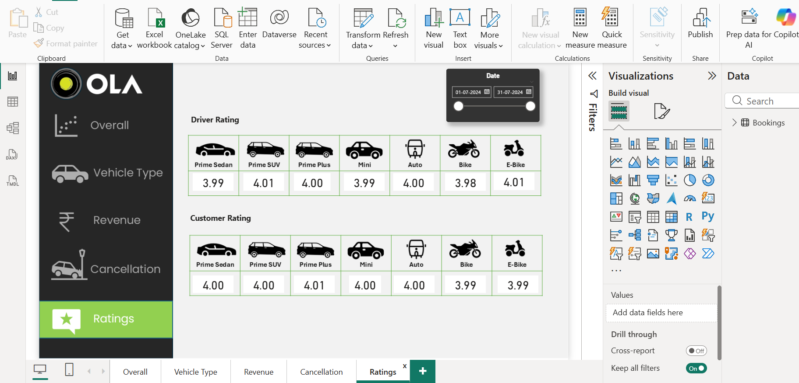
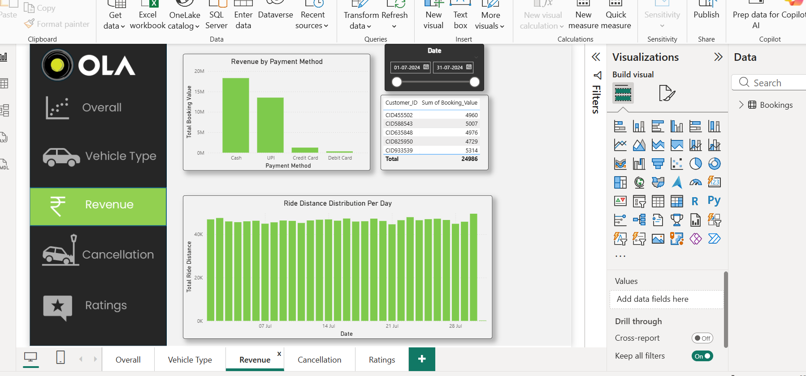
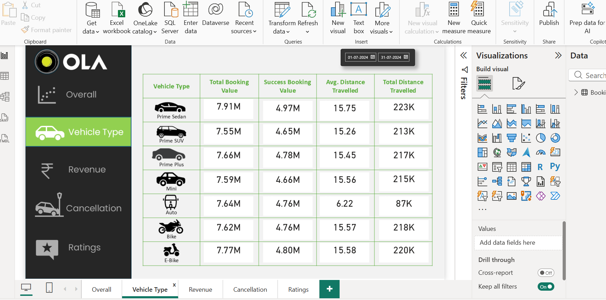
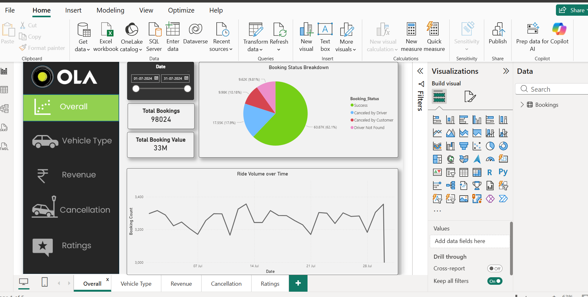

# Power BI & SQL Ola Ride Cancellation Dashboard

## Overview
Built a dashboard to analyze booking trends, cancellation patterns, and operational KPIs using SQL, Excel, and Power BI.

## Tools Used
- SQL
- Power BI
- Excel

## KPIs Analyzed
- Cancellation Rate
- Booking Trends
- Customer Behavior
- Driver Performance

## Key Insights
- Identified major cancellation reasons
- Analyzed peak booking periods
- Improved operational visibility using dashboards

## Dashboard Preview

